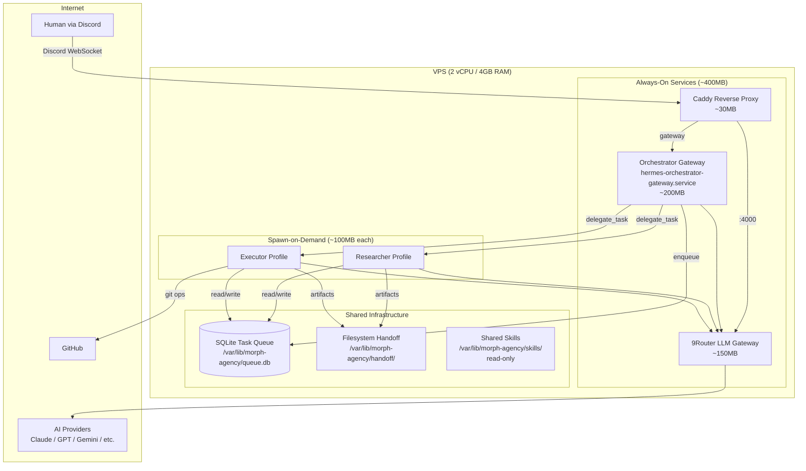
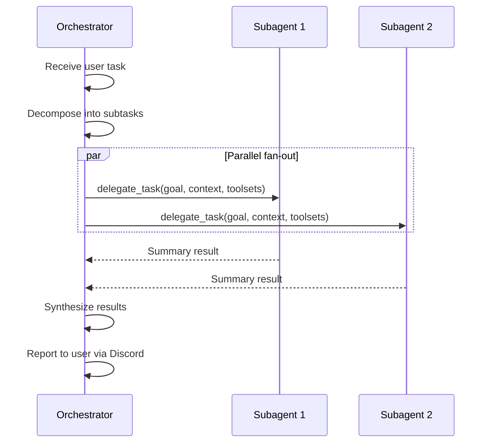
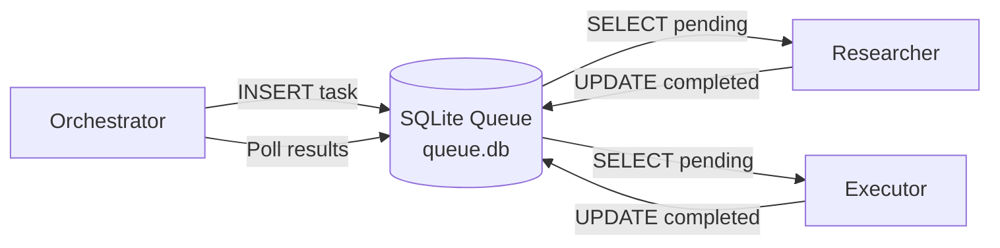
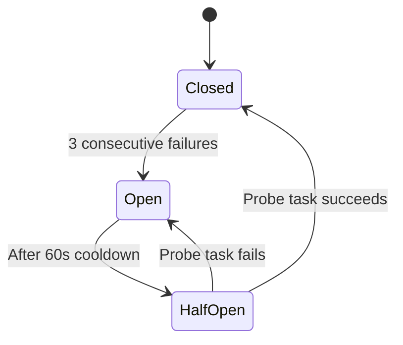

# Architecture — Morph AI Agent Software Agency

## Overview

Multi-agent autonomous software agency built on **Hermes Agent + 9router + Discord + Caddy**. Each agent is a long-lived Hermes profile with full isolation. Agents collaborate via an SQLite task queue and communicate with humans via Discord.

**VPS Target**: 2 vCPU / 4GB RAM / 80GB storage
**Deployment**: Hybrid spawn — orchestrator always-on, workers spawn-on-demand

---

## High-Level Architecture



---

## Memory Budget

| Component | RAM | Lifecycle | Notes |
|-----------|-----|-----------|-------|
| OS + systemd | ~300MB | always-on | Ubuntu minimal |
| Caddy | ~30MB | always-on | Reverse proxy + auto-TLS |
| 9Router | ~150MB | always-on | Single instance, all profiles share |
| Orchestrator gateway | ~200MB | always-on | Discord bot + agent loop |
| Worker agent (each) | ~100MB | spawn-on-demand | Spawned by orchestrator, exits after task |
| SQLite queue | ~0MB | in-process | No separate daemon |
| **Steady-state total** | **~680MB** | | |
| **Peak (2 workers)** | **~880MB** | | Well within 4GB |

---

## Profile Roster

### Phase 1 MVP

| Profile Name | Role | Description | Lifecycle | Discord Channel |
|-------------|------|-------------|-----------|-----------------|
| `orchestrator` | Task Router & Planner | Receives user requests, decomposes into tasks, delegates to workers, synthesizes results | Always-on | `#orchestrator` |
| `researcher` | Web Research & Analysis | Web search, doc lookup, technology scouting, competitive analysis | Spawn-on-demand | `#researcher` |
| `executor` | Code Generation & Ops | Code generation, file operations, git ops, build/test execution | Spawn-on-demand | `#executor` |

### Phase 2 Expansion

| Profile Name | Role | Justification for Separate Profile |
|-------------|------|------------------------------------|
| `reviewer` | Code Review & QA | Needs fresh context (no implementation bias), different LLM reasoning profile |
| `devops` | Infrastructure & Deployment | Elevated permissions for system ops, separate security boundary |

### Phase 3 Candidates

| Profile Name | Role | Justification |
|-------------|------|---------------|
| `writer` | Documentation & Content | Different tone/style from code agents, specialized prompting |
| `monitor` | Observability & Alerts | Long-running background checks, cron-based health monitoring |

---

## Cost Strategy via 9Router

Single 9Router instance with named combos per role. Each profile's `config.yaml` specifies its combo name in the `model.default` field.

| Profile | Combo Name | Primary Model | Fallback Chain | Cost Tier | Reasoning |
|---------|-----------|---------------|----------------|-----------|-----------|
| orchestrator | `combo:premium` | Claude Sonnet 4.6 | GPT-4o > Gemini 2.5 Pro | High | Strategic decisions, task decomposition, synthesis — needs strong reasoning |
| researcher | `combo:balanced` | Gemini 2.5 Flash | Claude Haiku 4.5 > GPT-4o-mini | Medium | Volume research queries, web-capable, cost-efficient |
| executor | `combo:budget` | Claude Haiku 4.5 | Gemini 2.5 Flash > DeepSeek V3 | Low | High-volume code gen, structured output, cost-optimized |
| reviewer | `combo:premium` | Claude Sonnet 4.6 | GPT-4o > Gemini 2.5 Pro | High | Catch subtle bugs, needs deep reasoning |
| devops | `combo:balanced` | Gemini 2.5 Flash | Claude Haiku 4.5 | Medium | System ops, balanced cost/capability |

### 9Router Combo Configuration

```yaml
# In 9Router db.json — combos section
combos:
  premium:
    strategy: fallback
    models:
      - provider: anthropic
        model: claude-sonnet-4-6-20250514
      - provider: openai
        model: gpt-4o
      - provider: google
        model: gemini-2.5-pro
  balanced:
    strategy: fallback
    models:
      - provider: google
        model: gemini-2.5-flash
      - provider: anthropic
        model: claude-haiku-4-5-20251001
      - provider: openai
        model: gpt-4o-mini
  budget:
    strategy: fallback
    models:
      - provider: anthropic
        model: claude-haiku-4-5-20251001
      - provider: google
        model: gemini-2.5-flash
      - provider: deepseek
        model: deepseek-chat
```

---

## Orchestration Pattern

### Layer 1 — Hermes Profiles (Long-lived Specialists)

Each role = separate Hermes profile with full isolation:

```
~/.hermes/profiles/
  orchestrator/
    config.yaml          # LLM via 9router combo:premium
    .env                 # DISCORD_BOT_TOKEN, API keys
    SOUL.md              # Orchestrator identity & authority
    memories/            # MEMORY.md, USER.md (auto-managed)
    sessions/            # Gateway session data
    skills/              # Profile-specific skills
    cron/                # Scheduled jobs
    logs/                # Activity & error logs
  researcher/
    ...                  # Same structure, different config
  executor/
    ...
```

Profile commands:
- `hermes profile create <name>` — bootstrap
- `hermes -p <name> gateway start` — start Discord gateway
- `hermes -p <name> chat` — interactive session
- CLI aliases auto-created: `orchestrator chat`, `researcher chat`, etc.

### Layer 2 — Subagents (Ephemeral Tasks)

Within each profile, `delegate_task` spawns short-lived subagents:



Subagent config in each profile's `config.yaml`:
```yaml
delegation:
  max_concurrent_children: 2    # Conservative for 4GB VPS
  max_spawn_depth: 1            # Flat only, no nested delegation
  orchestrator_enabled: false   # Workers don't delegate further
```

Orchestrator exception:
```yaml
delegation:
  max_concurrent_children: 3
  max_spawn_depth: 1
  orchestrator_enabled: true    # Can delegate to profiles
```

---

## Inter-Profile Communication

### Primary: SQLite Task Queue



Location: `/var/lib/morph-agency/queue.db`

Schema:
```sql
CREATE TABLE tasks (
    id TEXT PRIMARY KEY DEFAULT (lower(hex(randomblob(8)))),
    type TEXT NOT NULL,
    profile_target TEXT NOT NULL,
    payload TEXT NOT NULL,
    status TEXT NOT NULL DEFAULT 'pending',
    priority INTEGER DEFAULT 0,
    result TEXT,
    error TEXT,
    created_at TEXT DEFAULT (strftime('%Y-%m-%dT%H:%M:%fZ', 'now')),
    updated_at TEXT DEFAULT (strftime('%Y-%m-%dT%H:%M:%fZ', 'now')),
    expires_at TEXT
);

CREATE INDEX idx_queue ON tasks(status, profile_target, priority DESC, created_at);
```

Task lifecycle: `pending` -> `processing` -> `completed` | `failed`

Atomic claim pattern:
```sql
UPDATE tasks
SET status = 'processing', updated_at = strftime('%Y-%m-%dT%H:%M:%fZ', 'now')
WHERE id = (
    SELECT id FROM tasks
    WHERE status = 'pending' AND profile_target = ?
    ORDER BY priority DESC, created_at ASC
    LIMIT 1
)
RETURNING *;
```

### Secondary: Filesystem Handoff (Large Payloads)

For code artifacts, research documents, and large outputs:

```
/var/lib/morph-agency/handoff/
  <task-id>/
    input/       # Task input files
    output/      # Task result files
    metadata.json
```

Referenced by `payload.handoff_path` in the SQLite task record.

### Trade-off Analysis (Decision Record)

| Method | Latency | Complexity | Reliability | RAM | Chosen? |
|--------|---------|------------|-------------|-----|---------|
| **SQLite Queue** | <1ms + poll | Low-Medium | High (ACID) | ~0 | **Primary** |
| **Filesystem Handoff** | <1ms | Low | Medium | ~0 | **Secondary** (large payloads) |
| Discord Relay | 200-1000ms | Medium | Medium (depends on Discord) | 20-50MB/bot | No — too slow for agent-to-agent |
| MCP Bridge | 10-50ms | High | High | 50-150MB | No — overkill for current scale |

---

## Failure Handling

### Per-Profile Circuit Breaker



Implementation:
- Track failure count per profile in SQLite `profile_health` table
- Orchestrator checks health before delegating
- Fallback: orchestrator handles task directly if target profile unhealthy

### Retry Strategy

```yaml
# Per task in SQLite queue
max_retries: 3
retry_delay_seconds: [10, 30, 120]  # Exponential backoff
```

### Recovery Patterns

1. **Task timeout**: If `processing` for >10min, mark `failed`, re-enqueue
2. **Profile crash**: systemd `Restart=always` with `RestartSec=10`
3. **9Router down**: Hermes `fallback_providers` in config.yaml
4. **Disk full**: `90-doctor.sh` monitors disk usage, alerts at 85%

---

## Memory & Skill Strategy

### Memory Isolation

Each profile maintains its own:
- `MEMORY.md` — auto-consolidated persistent memory (~2,200 char limit)
- `USER.md` — auto-maintained user profile (~1,375 char limit)
- `sessions/` — conversation history (7-day retention)

### Skill Sharing Model (Shared Read-Only)

```
/var/lib/morph-agency/skills/       # Shared read-only skills
  common/
    git-workflow.md
    code-standards.md
    security-checklist.md

~/.hermes/profiles/<name>/skills/   # Profile-specific skills
  <specialized-skills>
```

Mounting: symlink or `skills.config` in each profile's config.yaml.

### Drift Prevention

1. **Prompt pinning**: SOUL.md version-controlled in git
2. **7-day memory rotation**: Sessions auto-purge, MEMORY.md auto-consolidates
3. **Skill curation**: Monthly review of accumulated skills per profile
4. **Behavioral anchoring**: SOUL.md re-loaded on every gateway restart

---

## Autonomy Rules

| Action | Policy | Enforcement |
|--------|--------|-------------|
| Git push to feature branch | **Allowed** | No gate |
| Git push to main/master | **Blocked** | SOUL.md instruction + `approvals.mode: smart` |
| Deploy to production | **Blocked** | SOUL.md instruction + explicit user confirmation |
| Delete non-temp files | **Blocked** | SOUL.md instruction + smart approval |
| Create/modify files in workspace | **Allowed** | No gate |
| Install packages | **Allowed with review** | Smart approval mode |
| Spend > $5/single task | **Warn** | 9Router budget monitoring |

---

## Implementation Roadmap

### Phase 1 — MVP (Week 1-2)

**Goal**: Orchestrator + Researcher + Executor running, Discord visible, basic task handoff.

- [ ] Setup scripts: `41-setup-hermes-profiles.sh`, `42-seed-profile-souls.sh`
- [ ] Profile configs: SOUL.md + config.yaml for orchestrator, researcher, executor
- [ ] Discord integration: `43-link-discord-channels.sh`, 3 bots, 3 channels
- [ ] Systemd services: `55-setup-systemd-per-profile.sh` (orchestrator always-on)
- [ ] SQLite queue: schema + basic enqueue/dequeue in orchestrator SOUL.md guidance
- [ ] 9Router combos: premium, balanced, budget
- [ ] Caddy update: route per-profile endpoints
- [ ] Doctor update: health check per profile
- [ ] Smoke test: user sends task in `#orchestrator`, orchestrator delegates to executor, result returned

### Phase 2 — Expansion (Week 3-4)

- [ ] Add reviewer profile (code review, QA)
- [ ] Add devops profile (infrastructure ops)
- [ ] Skill curation: seed common skills, per-profile specialized skills
- [ ] Human-in-the-loop checkpoints for destructive actions
- [ ] Task priority system in SQLite queue
- [ ] Inter-profile handoff patterns (research -> execute -> review pipeline)

### Phase 3 — Hardening (Week 5-8)

- [ ] Observability: per-profile cost tracking via 9Router dashboard
- [ ] Circuit breaker implementation
- [ ] Memory consolidation automation
- [ ] Drift detection (SOUL.md hash verification)
- [ ] Load testing: concurrent task throughput
- [ ] Backup/restore: profile export automation
- [ ] Alerting: disk/memory/cost thresholds via Discord webhook

---

## Key File Paths

| Path | Purpose |
|------|---------|
| `~/.hermes/profiles/<name>/` | Per-profile Hermes home |
| `/var/lib/morph-agency/queue.db` | SQLite task queue |
| `/var/lib/morph-agency/handoff/` | Large payload exchange |
| `/var/lib/morph-agency/skills/common/` | Shared read-only skills |
| `/opt/9router/` | 9Router installation |
| `/etc/caddy/Caddyfile` | Caddy reverse proxy config |
| `/etc/systemd/system/hermes-*-gateway.service` | Per-profile systemd units |
